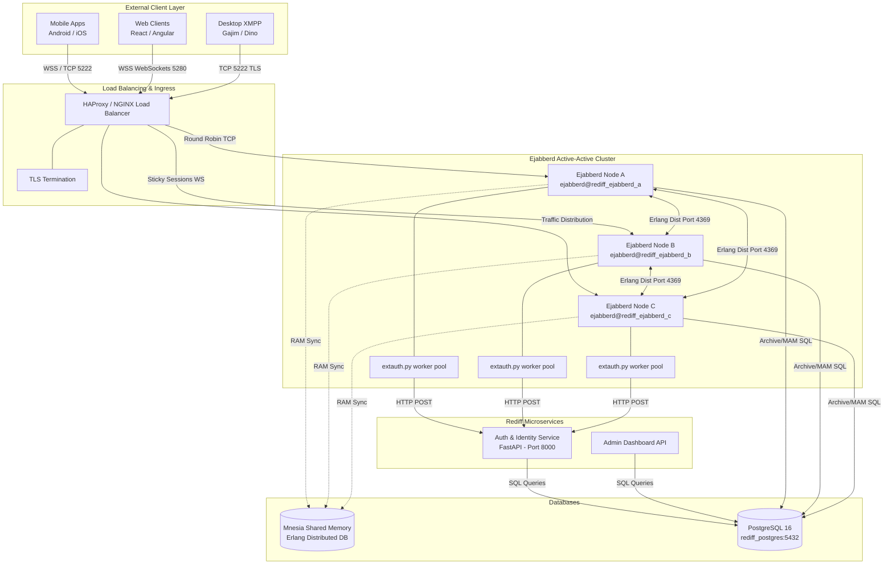
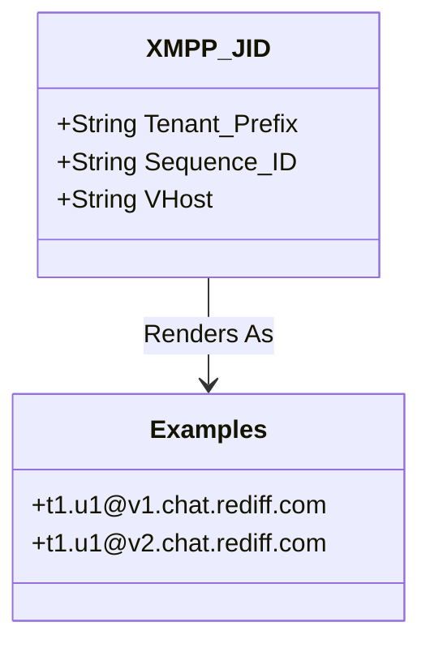

# 01. Detailed Project Architecture

The Rediff Enterprise Chat platform is designed as a highly scalable, multi-tenant XMPP messaging system. The core architectural philosophy is the **strict separation of messaging state from business logic**.

This document breaks down the system topology into extreme detail, mapping exactly how traffic flows from the outside world into the internal clusters.

## 1. Complete End-to-End System Topology

The diagram below illustrates the complete component architecture, detailing the specific ports, protocols, and scaling mechanisms used at each layer of the platform.

## 2. Core Architectural Components in Detail

### 2.1 The Proxy Layer (HAProxy / Ingress)
- **Role**: The single public-facing entry point for the entire chat infrastructure.
- **Port 5222 (XMPP over TCP)**: Used by native mobile and desktop applications. The load balancer uses a simple Round-Robin algorithm because XMPP maintains persistent, long-lived TCP connections.
- **Port 5280 (WebSockets / BOSH)**: Used by web browsers. The load balancer **must** be configured for Sticky Sessions (Session Affinity) because WebSocket upgrades require multiple HTTP handshakes to hit the same backend node.
- **TLS Termination**: Certificates are managed here to offload cryptographic decryption overhead from the Ejabberd cluster.

### 2.2 The Messaging Engine (Ejabberd)
- **Role**: Real-time routing of XML Stanzas (Messages, Presence, IQs).
- **Cluster Strategy**: The system uses a 3-node Active-Active topology. Any node can handle any user. If Node A crashes, Nodes B and C immediately take over without dropping the cluster state.
- **The `extauth.py` Bridge**: Ejabberd is written in Erlang. To communicate with our modern Python APIs, it spawns background Python workers (`extauth.py`). Ejabberd talks to these workers via standard I/O (stdin/stdout) using binary packets.

### 2.3 The Business Logic Layer (FastAPI)
- **Role**: Validating user identities and securely hashing passwords.
- **Why it's separate**: By keeping authentication logic out of Ejabberd, you can add 2FA (Two-Factor Authentication), OAuth, SSO, or temporary account lockouts without modifying a single line of XMPP server code.

## 3. Tenant Isolation Architecture (SaaS Model)

The platform is designed to serve multiple corporate clients simultaneously without data leakage.

### The Problem with Virtual Hosts
Traditionally, multi-tenant XMPP uses virtual hosts. This implementation keeps the Ejabberd cluster shared and scopes persistence by vhost in PostgreSQL, while Mnesia remains the shared runtime state layer.

### The Solution: Vhost-Scoped JIDs
Users connect through vhost-specific domains such as `v1.chat.rediff.com` and `v2.chat.rediff.com`.
Tenant isolation is enforced in the JID localpart and by the shared `mod_tenant_isolate` module.

- **Prefix**: `w` (Wipro), `inf` (Infosys). Instantly identifies the corporate boundary.
- **Sequence**: `10001`. A unique, incrementing integer.
- **Domain**: `@v1.chat.rediff.com` or the appropriate tenant vhost. Passwords are checked by Keycloak.

**The Isolation Rule**: A custom Erlang module (`mod_tenant_isolate`) intercepts every message. It splits the sender's prefix and the recipient's prefix. If `w` tries to message `inf`, the server instantly drops the message with a `<forbidden/>` XML error. No database lookups are required to enforce this security boundary.
