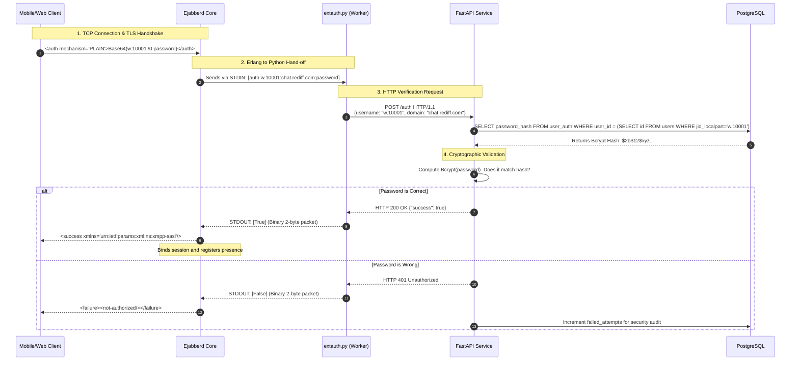
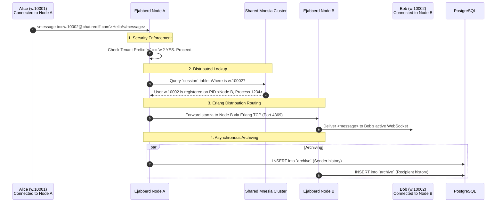
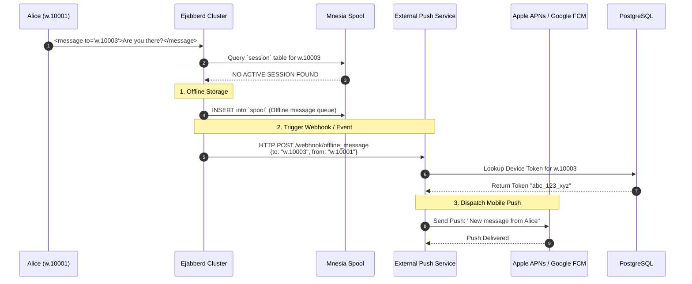

# 02. Advanced Working Flows

This document maps out the precise, step-by-step lifecycles of crucial system operations. It illustrates how the isolated components of the architecture interact in real-time.

---

## 1. The Authentication Lifecycle (External Auth)

This sequence details exactly what happens in the milliseconds between a user clicking "Login" and establishing a chat session.



---

## 2. Distributed Message Routing (Node-to-Node)

When users are connected to different physical servers, Ejabberd must locate them and route the message seamlessly.



---

## 3. Offline Message Handling & Push Notifications

If the recipient is not actively connected to any Ejabberd node, the system must queue the message and trigger a mobile push notification.



---

## 4. User Provisioning & JID Allocation

This details how the FastAPI backend creates a new user, automatically handles the math to generate their immutable JID, and syncs them to the database.

```mermaid
flowchart TD
    Start([HR Admin Creates User]) --> API[FastAPI: POST /users]
    
    API --> Parse{Extract Email Domain}
    Parse -->|alice@infosys.com| DB1[Query `tenant_domains` for 'infosys.com']
    
    DB1 --> Check{Domain Exists?}
    Check -->|No| Reject[Return 400 Error: Tenant not configured]
    Check -->|Yes| DB2[Retrieve Tenant Prefix: 'inf']
    
    DB2 --> DB3[Lock `tenants` table]
    DB3 --> DB4[Increment `user_sequence`]
    DB4 --> JID[Generate JID: 'inf' + '.' + '12055']
    
    JID --> Hash[Bcrypt Hash the Password]
    
    Hash --> Insert1[(Postgres: INSERT INTO users)]
    Insert1 --> Insert2[(Postgres: INSERT INTO user_auth)]
    
    Insert2 --> Success([Return 201 Created: inf.12055@chat.rediff.com])
```
