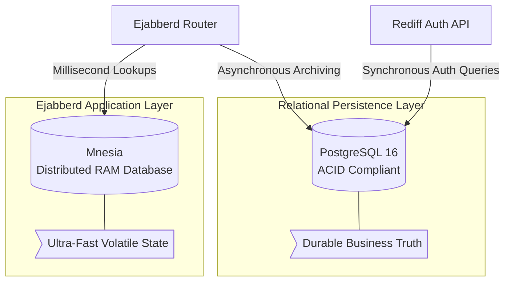
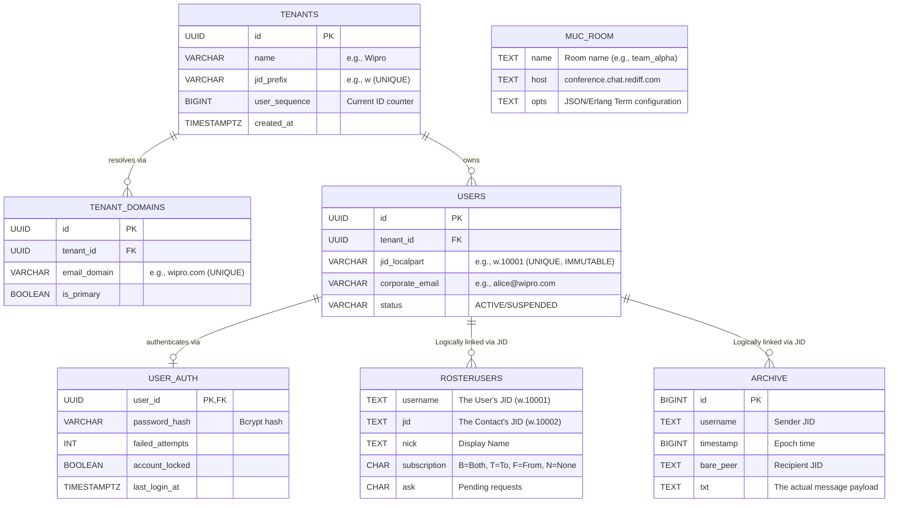

# 03. Comprehensive Database Structure

The Rediff Enterprise Chat architecture heavily relies on polyglot persistence. It utilizes two entirely different database engines (`Mnesia` and `PostgreSQL`), strictly isolating them based on the volatility and relational complexity of the data.

This document maps the entire schema and details the data flow between engines.

---

## 1. The Dual-Database Topology

The platform does not treat databases identically. Mnesia is embedded inside the application RAM for microsecond speed, while PostgreSQL sits external to the application for infinite scaling and complex querying.

---

## 2. Global Entity-Relationship (ER) Diagram

This massive diagram shows exactly how the Auth-Service tables (Tenant management) logically link to the native Ejabberd tables (XMPP functionality) via the `JID` string.

---

## 3. Mnesia Schema (The Ephemeral Engine)

Mnesia is not relational. It is a Key-Value/Record store distributed across the cluster. If the entire cluster is shut down, this data is mostly rebuilt dynamically when users reconnect.

| Table Name | Erlang Record Type | Primary Purpose | Volatility |
| :--- | :--- | :--- | :--- |
| **`session`** | `{session, {Username, Server, Resource}, PID}` | Maps an active user connection to the exact physical Ejabberd Node process handling their TCP socket. | Extreme (Changes constantly) |
| **`route`** | `{route, Domain, PID, LocalHint}` | Internal DNS-like table. Tells Node A how to forward packets to the internal chat room service on Node B. | Low (Changes on node boot) |
| **`muc_online_room`** | `{muc_online_room, Name, Host, PID}` | Stores the runtime state of a group chat (who is typing, who is currently in the room). | High (Changes as users join/leave) |
| **`s2s`** | `{s2s, From, To, PID}` | Tracks Server-to-Server federation links. | Medium |

### Mnesia Replication Flow
Mnesia uses a masterless, multi-master replication model.
1. User connects to Node A.
2. Node A writes `{session, "w.10001", PID_A}` to local Mnesia RAM.
3. Mnesia synchronously broadcasts this record to Node B and Node C over Port 4369.
4. Node B and Node C update their local RAM.
5. If Node C needs to message "w.10001", it does a 0.01ms local RAM read, sees PID_A, and forwards the message.

---

## 4. PostgreSQL Schema (The Durable Engine)

This is the primary state store. It handles data that must survive server restarts, disaster recovery scenarios, and complex administrative queries.

### 4.1 Rediff Custom Tables (Identity)
These tables are completely unknown to Ejabberd. They are strictly managed by your FastAPI Python service to guarantee business rules (like uniqueness and password strength) are enforced outside of the messaging core.
- **`tenants` & `tenant_domains`**: Essential for the SaaS routing model. Allows `hr@wipro.com` and `sales@wipro.co.in` to map to the identical `w` JID prefix.
- **`user_auth`**: Legacy table from the old central-auth design. Passwords are now stored in Keycloak, not PostgreSQL.

### 4.2 Ejabberd Native Tables (XMPP)
Ejabberd uses an internal SQL driver to connect to `rediff_postgres`. The schema for these tables (e.g., `rosterusers`, `archive`) is generated by Ejabberd's `pg.sql` file.
- **`rosterusers`**: Manages the friend/contact list. Ejabberd uses this to calculate who is allowed to see someone's "Online/Offline" presence status.
- **`archive` (MAM - Message Archive Management)**: Crucial for multi-device sync. If Alice sends a message from her phone, her desktop app pulls from this SQL table to display the historical message. Ejabberd writes to this table asynchronously to prevent database latency from slowing down real-time chat delivery.
